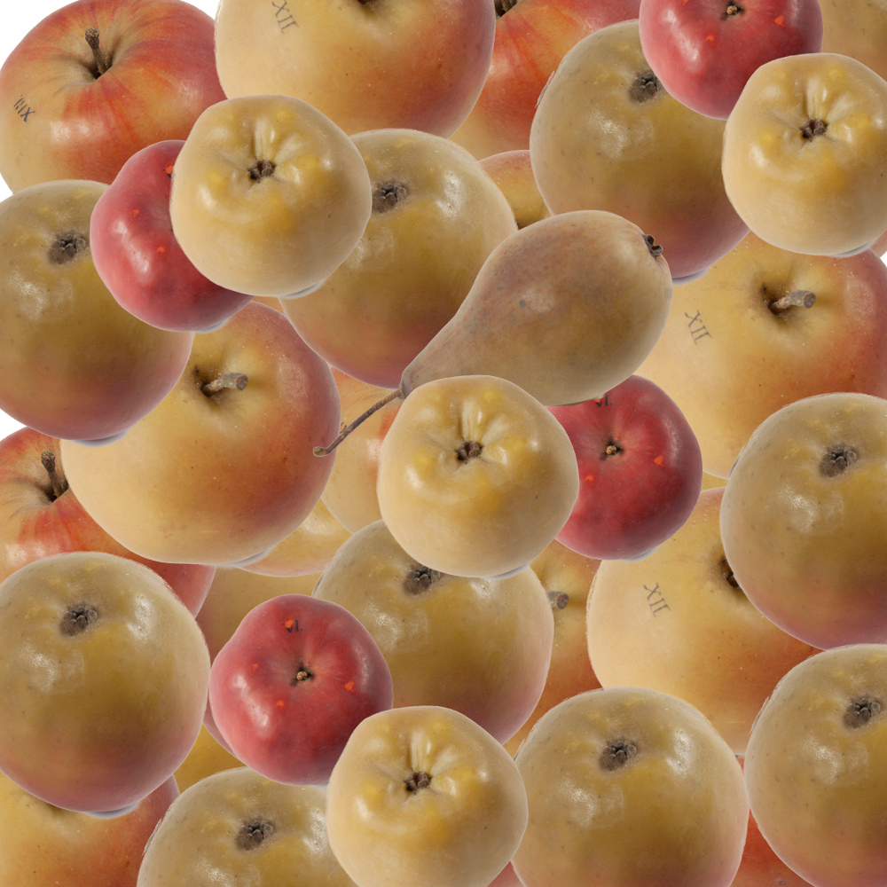

# Äpfel und Birnen

Äpfel und Birnen (apples and peaches) is a hidden object browser game made with images of apples and
peaches of the wax fruit collection of Stiftung Schloss Friedenstein. 
It's supposed to be entered into the competition for 
[Coding Da Vinci Ost 2018](https://codingdavinci.de/events/ost).

If you like to contribute: Feel free to make a pull request at any time.

## Roadmap

* 1st May 2018: Working protoypes of all components
* 1st June 2018: First Working Version
* 10th June 2018: Final Version
* 16th June 2018: Presentation at the Coding Da Vinci Ost Closing Event

## License

[GNU General Public License v3](https://www.gnu.org/licenses/gpl-3.0.de.html)

## Data

We use the [Modellfrüchte](https://casimir.bsz-bw.de/frontdoor/index/index/docId/18)
dataset, provided by [Stiftung Schloss Friedenstein](http://www.stiftungfriedenstein.de/).
All images are provided by Stiftung Schloss Friedenstein under 
a [CC0 license](https://creativecommons.org/publicdomain/zero/1.0/legalcode).

## Artwork

