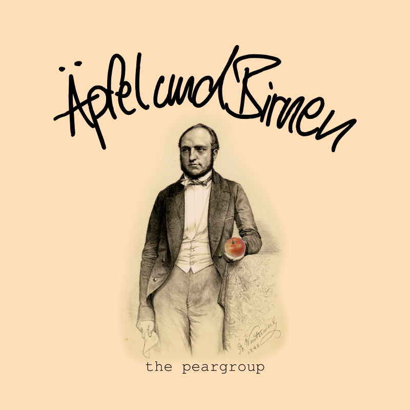

# Äpfel und Birnen

Äpfel und Birnen (apples and peaches) is a hidden object browser game made with images of apples and
peaches of the wax fruit collection of Stiftung Schloss Friedenstein. 
It's supposed to be entered into the competition for 
[Coding Da Vinci Ost 2018](https://codingdavinci.de/events/ost).

If you like to contribute: Feel free to make a pull request at any time.

## Roadmap

* 1st June 2018: First Working Version
* 10th June 2018: Final Version
* 16th June 2018: Presentation at the Coding Da Vinci Ost Closing Event

## License

* Software:
[GNU General Public License v3](https://www.gnu.org/licenses/gpl-3.0.de.html)
* Media: [CC-BY](https://creativecommons.org/licenses/by/2.0/) "the peargroup"

## Datasets

The following datasets which were submitted for Coding Da Vinci Ost 2018 were used:

* [Modellfrüchte aus Wachs](https://casimir.bsz-bw.de/frontdoor/index/index/docId/18) by [Stiftung Schloss Friedenstein](http://www.stiftungfriedenstein.de/) (License: CC0)
* [Modelle antiker Bauwerke aus Kork](https://casimir.bsz-bw.de/frontdoor/index/index/docId/18) by [Stiftung Schloss Friedenstein](http://www.stiftungfriedenstein.de/) (License: CC0)
* [Buchhändlerportraits](https://speicherwolke.uni-leipzig.de/index.php/s/HScdv0wr2lQe63e) by [Deutsche Nationalbibliothek, Deutsches Buch- und Schriftmuseum Leipzig](http://www.dnb.de/DE/DBSM/dbsm_node.html) (License: CC0)
* [Antike Keramik](https://speicherwolke.uni-leipzig.de/index.php/s/IvHiDl76pCQ1ulq) by [Lindenau-Museum Altenburg](https://www.lindenau-museum.de/) (License: CC-BY 4.0 International)

## the peargroup

As of June 2018 _the peargroup_ consists of three members: 

* Florian Rämisch
* Peter Mühleder
* Tracy Hoffmann
